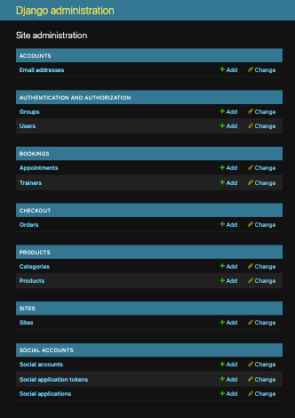
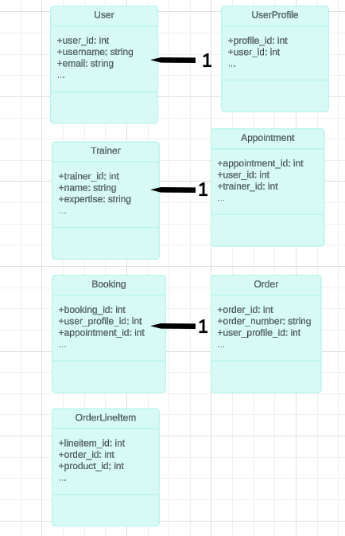
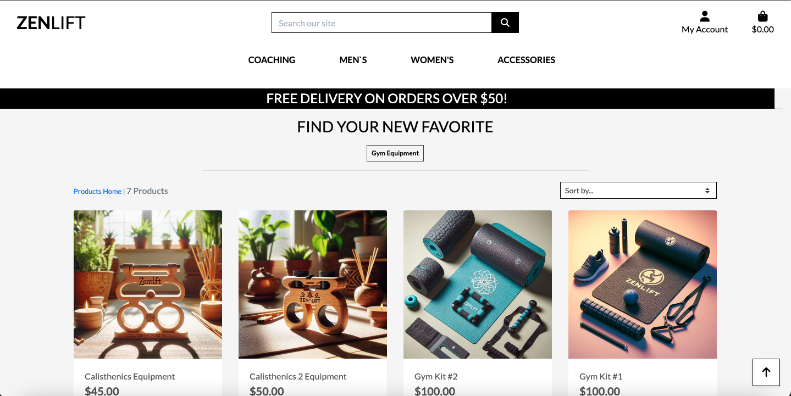
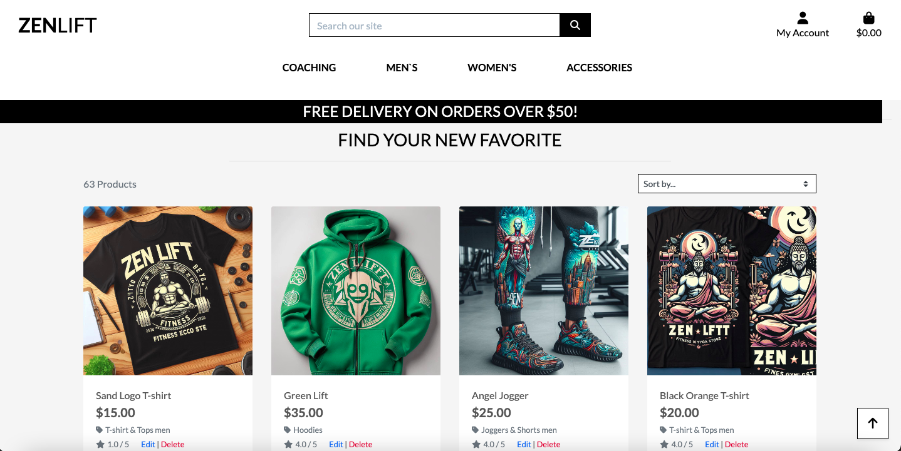
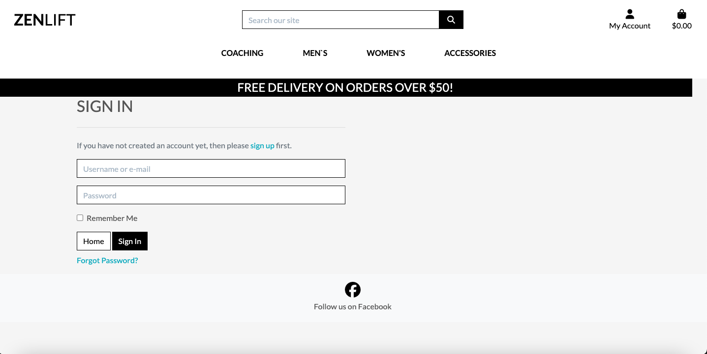
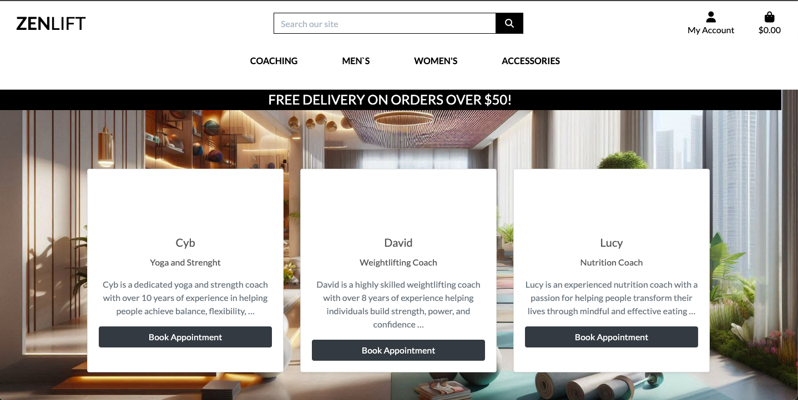
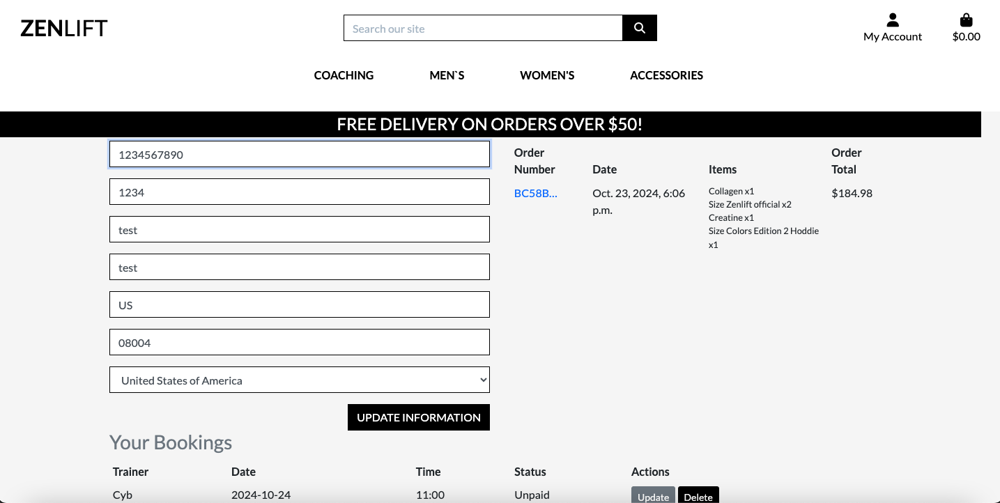
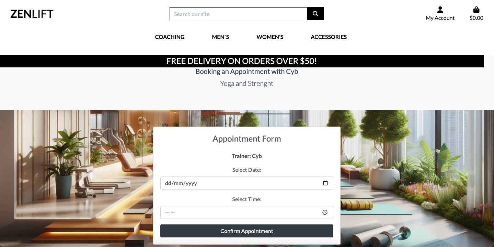
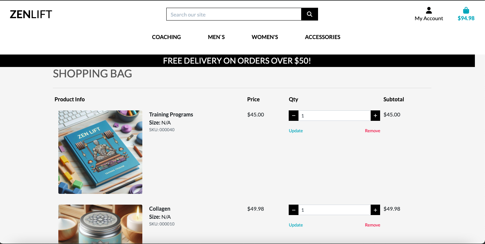
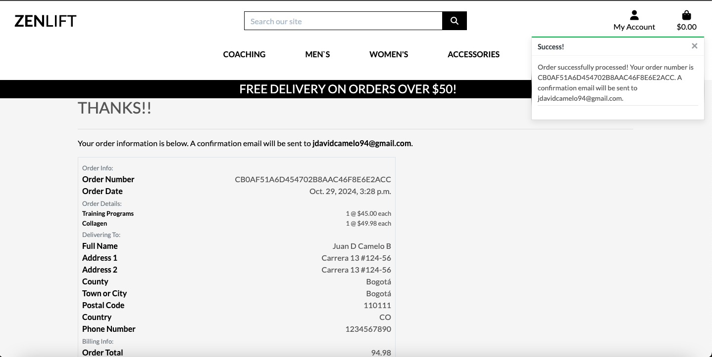

Welcome, 
This has been the most dificult project i've done so far , stuggling in the fact that to become a good devoper my journey is just starting, this are the basics, at least I have been training them, because for bxecoming a good developer there are so many things that still needs to be learn , still I'm glad of the company Code Insitute provide me. is the best I can do and im happy and enjoy the process, thanks for taking the time to check what i've learn -J.D.C.

# ZenLift

### E-commerce webpage

___

ZenLift is a platform designed for fitness enthusiasts, offering products, personal coaching, and resources for a holistic fitness experience. Users can browse through training sessions, e-books, and a variety of men's and women's clothing. There’s also an extensive range of accessories, from gym and yoga equipment to vitamins and supplements, aiming to support wellness and fitness journeys. The site features perks like free delivery on larger orders and offers easy account management for a seamless shopping and training experience.

Link to live site - [https://zenlift-bb4261ea5a00.herokuapp.com/](https://zenlift-bb4261ea5a00.herokuapp.com/)

## Site Objectives

ZenLift offers users an all-in-one fitness platform with products, training, and wellness resources, supporting every step of a fitness journey. The site focuses on seamless navigation, holistic health, and quality service to inspire and support its community

Main objectives were:

- ### Promote Fitness Resources:

  Provide users with access to fitness products, training sessions, and e-books to support wellness goals.

- ### Enhance User Experience

  Offer smooth navigation and account management for a seamless shopping and training experience.

- ### Make use backend functionality

  Django’s powerful backend framework, the site allows users to create profiles, book reservations and buy items. This functionality provides a dynamic and interactive user experience, ensuring that users can easily engage with the content.

- ### Build Brand Trust

  Highlight benefits like free shipping on large orders and quality customer support to foster loyalty and satisfaction, featuring trusted payment options via Stripe for safe transactions.

# User Experience/UX

## Target Audience

- Fitness enthusiasts and individuals looking for personalized fitness guidance, resources, and high-quality products to support their wellness journeys.

## User Stories

### New Visitor Goals

- Clearly understand ZenLift’s mission and one-on-one coaching options.
- Discover personalized training programs and other site offerings.
- Sign up to track progress, access personal training sessions, and connect with expert coaches.

### Existing Visitor Goals

- Easily log in/out and manage their profiles.
- Access and schedule one-on-one training sessions, view personalized plans, and track fitness goals.
- Purchase recommended products, manage orders, and share feedback to engage with the community.

# Design Choices

## Colour Scheme

ZenLift’s color scheme uses vibrant and energetic hues to inspire motivation and energy in fitness. Neutral tones balance the layout, with bold accents on actionable items like buttons and links, enhancing visibility and encouraging engagement.

## Typography

The primary font is Montserrat, chosen for its modern, clean style and readability across all devices. A bolder, stylized font is used for the logo to add impact and brand recognition.

## Logo and Favicon

The logo and favicon capture ZenLift’s essence, featuring an icon symbolizing strength or growth, aligning with the fitness and wellness focus.

## Wireframes

- Conceptual wire frame made as sketchs

- Desktop Search Wireframe

- Desktop Others Wireframe

## Database Plan

The database plan for the "Street Seeker" app is straightforward, capturing essential information about users, bookings, checkout - payments, products, profiles -accounts. It outlines the type of data stored and indicates whether a field is a Primary or Foreign key where applicable.

  

### Entities and Attributes
1. User
- user_id (Primary Key): Integer, unique identifier for each user.
- username: String, unique username for login.
- email: String, unique email address.
- password: String, hashed password for security.
- first_name: String, user's first name.
- last_name: String, user's last name.
- is_active: Boolean, indicates if the user account is active.
- is_staff: Boolean, indicates if the user has admin privileges.
- date_joined: DateTime, timestamp of when the user account was created.
2. Trainer
- trainer_id (Primary Key): Integer, unique identifier for each trainer.
- name: String, full name of the trainer.
- expertise: String, area of expertise (e.g., strength training, nutrition).
- bio: Text, detailed biography of the trainer.
3. Appointment
- appointment_id (Primary Key): Integer, unique identifier for each appointment.
- user (Foreign Key): References the User table, linking to the user who booked the appointment.
- trainer (Foreign Key): References the Trainer table, linking to the trainer for the appointment.
- date: Date, the date of the appointment.
- time: Time, the time of the appointment.
- payment_status: Boolean, indicates whether payment has been made for the appointment.
4. UserProfile
- profile_id (Primary Key): Integer, unique identifier for each user profile.
- user (One-to-One Foreign Key): References the User table, linking to the user.
- default_phone_number: String, optional phone number for the user.
- default_street_address1: String, optional primary address.
- default_street_address2: String, optional secondary address.
- default_town_or_city: String, optional city or town.
- default_county: String, optional county.
- default_postcode: String, optional postal code.
- default_country: CountryField, user's default country (e.g., US).
5. Booking
- booking_id (Primary Key): Integer, unique identifier for each booking.
- user_profile (Foreign Key): References the UserProfile table, linking to the user's profile.
- appointment (Foreign Key): References the Appointment table, linking to the booked appointment.
- booking_date: DateTime, timestamp of when the booking was created.
- status: String, current status of the booking (e.g., confirmed, cancelled).
6. Order
- order_id (Primary Key): Integer, unique identifier for each order.
- order_number: String, unique order number generated using UUID.
- user_profile (Foreign Key): References the UserProfile table, linking to the user making the order.
- full_name: String, full name of the user.
- email: EmailField, user's email address.
- phone_number: String, user's phone number.
- country: CountryField, user's selected country.
- postcode: String, user's postal code.
- town_or_city: String, city or town of the user.
- street_address1: String, primary address.
- street_address2: String, optional secondary address.
- county: String, optional county.
- date: DateTime, timestamp of when the order was created.
- delivery_cost: Decimal, cost of delivery.
- order_total: Decimal, total cost of items ordered.
- grand_total: Decimal, total amount including delivery costs.
- original_bag: Text, serialized data of the user's cart.
- stripe_pid: String, unique identifier for the Stripe payment.
7. OrderLineItem
- lineitem_id (Primary Key): Integer, unique identifier for each line item.
- order (Foreign Key): References the Order table, linking to the corresponding order.
- product (Foreign Key): References the Product table, linking to the purchased product.
- product_size: String, size of the product (optional).
- quantity: Integer, quantity of the product ordered.
- lineitem_total: Decimal, total cost for the line item.

### Relationships

- A User can have one UserProfile.
- A User can book multiple Appointments.
- A Trainer can have multiple Appointments.
- A UserProfile can have multiple Bookings.
- Each Booking is associated with one Appointment.
- A UserProfile can have multiple Orders.
- Each Order can have multiple OrderLineItems.
- Each OrderLineItem is linked to a specific Product.

  

## Features

### User Registration & Profile

- Users can create and manage accounts with personal details for seamless booking and orders.
- Profiles allow easy updates to contact and address information.

### Trainer Booking

- Users can browse and book appointments with trainers, viewing trainer expertise and schedules.
- Simple management of upcoming and past appointments, with options to update or cancel.

### Order Management

- Users can place orders and view their order history, with each order detailing items, quantities, and total costs.
- Profiles store default addresses to streamline order checkout.

### Payment Tracking

- Appointments and orders have real-time payment status tracking, ensuring clear updates for users.

### Future Features

- **Enhanced Trainer Profiles:** Detailed trainer profiles with user reviews and expertise levels.
- **Advanced Scheduling Options:** Add reminders, recurring bookings, and waitlist options.
- **User-Uploaded Content:** Allow users to upload reviews and photos post-session.
- **Community Forum:** A live chat or forum for users to connect and discuss wellness topics.
- **Mobile Integration:** Push notifications for bookings and special offers.

# Screen display

here are share some of the most importat screen display of the app 

## Technologies Used

- [Gitpod](https://gitpod.com/): IDE for developing the project.
- [GitHub](https://github.com): Repository hosting and version control.
- [PEP8 Validator](https://pep8ci.herokuapp.com/): Linter for Python code.
- [ElephantSQL](https://www.elephantsql.com/): PostgreSQL database hosting.
- [Heroku](https://id.heroku.com/): Platform for deploying the application.
- [Stripe](https://stripe.com/): Payment processing integration.
- [AWS S3](https://aws.amazon.com/s3/): Storage for static files.
- **Photoshop**: Image editing for project visuals.

## Programming Languages, Frameworks, and Libraries Used

- [HTML](https://developer.mozilla.org/en-US/docs/Web/HTML): For structuring the web pages.
- [CSS](https://developer.mozilla.org/en-US/docs/Learn/Getting_started_with_the_web/CSS_basics): Styling the website's layout and appearance.
- [JavaScript](https://developer.mozilla.org/en-US/docs/Web/JavaScript): Adding interactivity to the site.
- [Python](https://en.wikipedia.org/wiki/Python_(programming_language)): Backend language for server-side functionality.
- [Django](https://www.djangoproject.com/): Web framework for handling server requests and app functionality.
- [Bootstrap](https://getbootstrap.com/): Frontend framework for responsive design and UI components.

# Agile

This project was designed using Agile methodology, utilising the Project Board and Issues sections in GitHub

- [Project Board](https://github.com/users/Juandavidc08/projects/6)

# Testing Process

The project underwent thorough testing throughout development, with each feature, model, and function meticulously verified for functionality and design alignment.

## Testing Strategy

### Incremental Feature Testing
- Each new component was individually tested for accurate functionality and styling upon creation. Issues were corrected promptly before moving forward.

### User Acceptance Testing (UAT)
- A select group of users tested the platform, creating accounts, making bookings, adding, and deleting comments. Testing was conducted across multiple devices (iOS, Android) and screen sizes for cross-platform reliability.

### Continuous Feedback Cycle
- Feedback from users was documented and swiftly integrated, ensuring consistent improvement. This feedback loop contributed to a seamless, reliable experience across devices.

## The table below summarizes the issues identified during testing and the corresponding fixes implemented:

| Issue Description                    | Testing Phase       | Device/Platform | Resolution                                  |
|--------------------------------------|---------------------|-----------------|---------------------------------------------|
| Trainer profile page styling issue   | Incremental        | All             | Adjusted CSS for consistency                |
| Booking form submission error        | User Testing       | iOS, Android    | Resolved form validation and error display  |
| Appointment cancellation bug         | User Testing       | Mobile, Tablet  | Fixed logic in the cancellation workflow    |
| Order history display inconsistency  | Incremental        | All             | Corrected table layout and formatting       |
| Payment form display                 | Incremental        | All             | Adjusted CSS for alignment &  responsiveness|

## Testing

### Admin Testing

| TEST                                        | OUTCOME                                                      | PASS/FAIL |
|---------------------------------------------|--------------------------------------------------------------|-----------|
| Create Trainer                              | Trainer profile created and visible in trainer list          | Pass      |
| Edit Trainer Details                        | Error during update due to validation issue (*)              | Fail      |
| Edit Trainer Details (after fix)            | Trainer details successfully updated                         | Pass      |
| Delete User Comment                         | Comment removed without issues                               | Pass      |
| Delete Trainer Profile                      | Trainer profile removed from trainer list                    | Pass      |
| Manage Order Status                         | Admin updated order status with real-time tracking updates   | Pass      |
| Update Appointment Payment Status           | Payment status update reflected on user profile              | Pass      |

### User Testing

| TEST                                         | OUTCOME                                                      | PASS/FAIL |
|----------------------------------------------|--------------------------------------------------------------|-----------|
| User Registration                            | Account created successfully                                 | Pass      |
| Profile Update                               | User updated profile details without errors                  | Pass      |
| Trainer Booking                              | Appointment booked and confirmation displayed                | Pass      |
| Update Appointment                           | Appointment rescheduled successfully                         | Pass      |
| Cancel Appointment                           | Appointment canceled, notification received                  | Pass      |
| Order Placement                              | Order created with items, quantities, and cost details      | Pass      |
| Order Payment Status Tracking                | Payment status updated in real-time                          | Pass      |
| View Order History                           | Users able to view past orders with complete item details    | Pass      |
| Access Unauthorized Content (restricted)     | Proper access error displayed                                | Pass      |
| Buy Products                                 | Products purchased successfully, order summary displayed     | Pass      |
| Payment Processing for Products              | Payment processed accurately, confirmation received          | Pass      |
| View Purchase History                        | Users can see a history of all purchased products           | Pass      |

## Bugs

### Deployment Issues
- During the deployment process on Heroku, I encountered several issues that prevented the app from launching successfully. This was primarily due to misconfigurations in the deployment settings. To resolve these issues, I:
  - Carefully reviewed the deployment logs to identify errors.
  - Corrected any configuration discrepancies in the `settings.py` file.

### Stripe Payment Integration Problems
- There were challenges integrating Stripe for payment processing, where transactions were not being processed correctly. To fix this:
  - I verified the API keys and ensured they were set correctly in the environment variables.
  - Conducted thorough testing of the payment flow to confirm successful transactions.

### Database Setup and Connectivity
- Issues arose with the database connection during initial setup and after redeployment. To address this:
  - I reconfigured the PostgreSQL database settings in Django.
  - Verified that all migrations were applied and the database was in sync with the application.

  ### New App Creation Conflicts
- While attempting to create a new app in Heroku, conflicts arose due to the existing deployment. To resolve this:
  - I ensured that the new app did not overlap with the current deployment.
  - Reviewed the Heroku configuration to avoid conflicts with the existing resources.

  ## Validation Testing

### HTML & CSS

HTML testing was completed using [W3 Validator](https://validator.w3.org/)

CSS testing was completed using [W3 Validator](https://jigsaw.w3.org/css-validator/)

### Github Deployment

- The source code for this website was managed and version-controlled using GitHub. Here’s a summary of the deployment process:

- To ensure that all changes are properly tracked and updated in your GitHub repository, follow these steps:

- Stage Changes:

- Open your terminal within your IDE.
- Run the command: git add . to stage all modified files for commit.

- Commit Changes:

- Next, create a commit with a descriptive message using: git commit -m "commit message".
- This command captures a snapshot of your changes and adds it to your local Git history.

- Push Changes:

- Finally, push your commits to the remote repository on GitHub by running: git push.
- This updates your GitHub repository with the latest code changes, making them available online.
- These steps ensure that your codebase remains synchronized with the GitHub repository, providing a reliable version control system for your project.

### Repository deployment via Heroku

- To deploy your project to Heroku, follow these steps:

- Create a New App:

- Navigate to the Heroku Dashboard.
- Click on New and select Create New App from the dropdown menu.

- Configure Your App:

- On the subsequent page, enter your desired App name and select a Region.
- Click Create app to proceed with the setup.

- Set Configuration Variables:

- Go to the Settings tab of your app and click Reveal Config Vars.
- Add the following configuration variables:
- Additional credentials required for this app:
- Cloudinary URL
- PostgreSQL Database URL

- Add Buildpacks:

- Still in the Settings tab, click Add buildpack.
- First, select Python as the buildpack.
- Then, add Node.js as the second buildpack.

- This process sets up your Heroku environment with the necessary configurations and buildpacks, enabling your application to deploy and run smoothly.

### Deployment of the app

- To deploy your app on Heroku, follow these steps:

- Connect to GitHub:

- Navigate to the Deploy tab in your Heroku app dashboard.
- Click on GitHub under Deployment method and select Connect to GitHub.

- Link Your Repository:

- Enter the name of your GitHub repository in the search field and click Search.
- Select the correct repository from the search results and click Connect to link it to your Heroku app.

- Choose Deployment Method:

- You can choose between Manual or Automatic deployment:
- Manual Deployment: Deploy your app by clicking Deploy Branch whenever you push changes to GitHub.
- Automatic Deployment: Automatically deploy your app whenever you push changes to the selected branch on GitHub.

- Deploy and Launch:

- Once the deployment method is selected, Heroku will build and deploy your app.
- After the build process completes, click the Open app button, which appears below the build information window, to view your live app.
- Alternatively, you can find another Open app button in the top right corner of the page.
- These steps ensure that your app is connected to GitHub and can be deployed and accessed via Heroku.

## Credits

This project is built upon the foundational framework provided by Code Institute's "Boutique_Ado" walkthrough module. The initial blog template served as a base, which was customized using Bootstrap and custom CSS to meet the specific requirements of this application.

To [codementor](https://codementor.io/) for being a support when i felt stuck and could find any help with actual explanations.

Alot of credits to CODEMY for their incredible explanations on their tutorias of django in youtube , the best of all its free and I did learn so much many concepts I did have miss before [@Codemycom](https://www.youtube.com/watch?v=cb1Pr8-m5YE&t=36)

Also from youtube to [@TechWithTim] one of my favorites youtubers of all, with these videos he simplified what sometimes is give to you as if it was impossible (https://www.youtube.com/watch?v=nGIg40xs9e4&t=799s)

The Readme layout was based on the example by [markdaniel1982](https://github.com/markdaniel1982/MD82-P4/blob/main/README.md?plain=1) it was an amazing read me thanks alot.

## Images 

- Background, images where generated using ai tools from [designer microsoft ](https://designer.microsoft.com/image-creator)

## Acknowledgments and Thanks

- Sarah and Roo at Code Institute's tutor support for the help. 

- Carlos Aguilar [Codementor](https://www.codementor.io/) 

- John Elder [Codemy](https://www.youtube.com/@Codemycom) 

- Tech with tim [@TechWithTim] (https://www.youtube.com/@Techwithtim) 